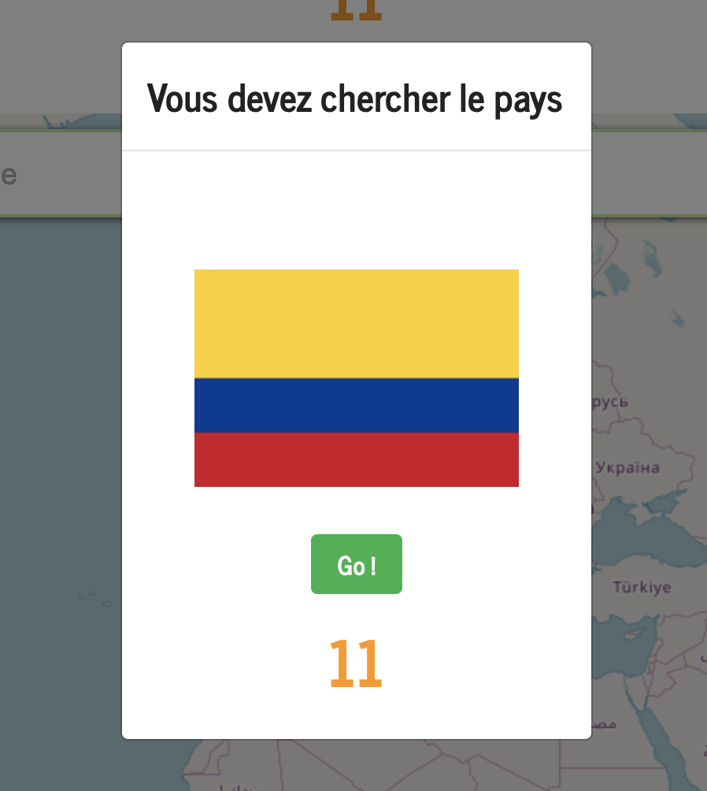
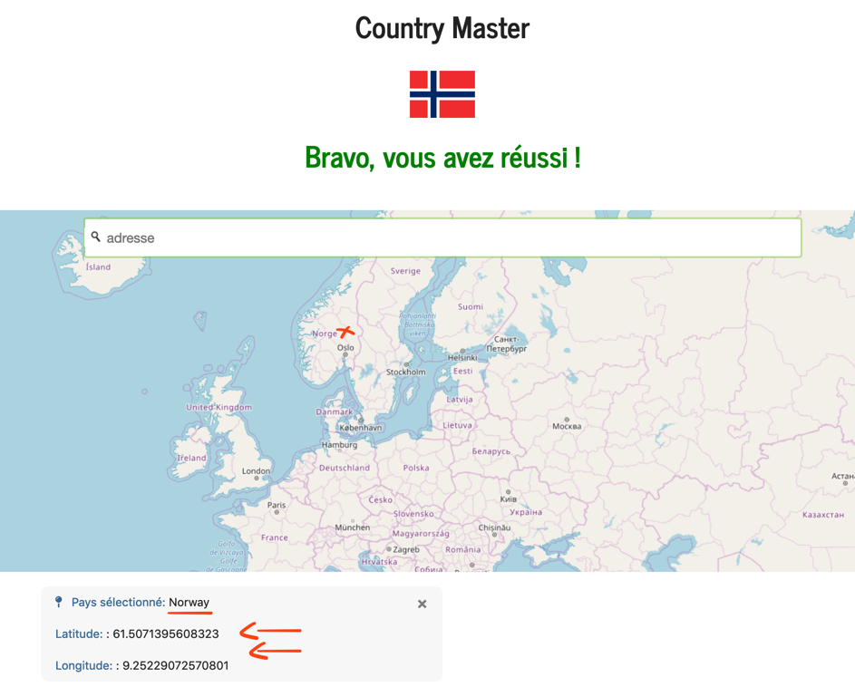
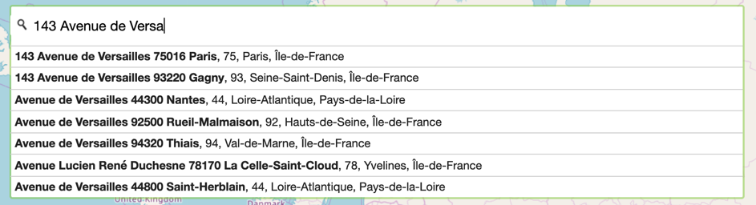

# CountryMaster

<h2>Running the game</h2>

First, you'll need to launch the index.php file on a Server such as MAMP for MacOS or WAMP for Windows.

The next step is to access to "/V/map.html" to play the game, this allows you to not login and import a database.

<h2>The Game</h2>

The aim of the game is to find a country of the map from the flag in a while.

<h2>Search an adress</h2>

It's also possible to search an adress in France with a searchbar using jQuery and an adress Database API.

